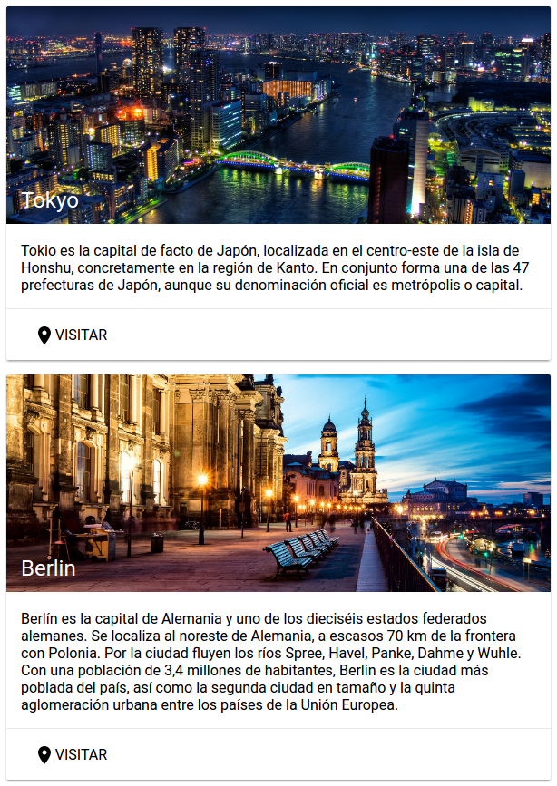

# Ejemplo 5

Un ejemplo de uso de los componentes del catalogo de Polymer:

- [Iron Icons](https://elements.polymer-project.org/elements/iron-icons)
- [Iron Icon](https://elements.polymer-project.org/elements/iron-icon)
- [Paper Button](https://elements.polymer-project.org/elements/paper-button)
- [Paper Card](https://elements.polymer-project.org/elements/paper-card)
- [Paper Dialog](https://elements.polymer-project.org/elements/paper-dialog)
- [Neon Animation](https://elements.polymer-project.org/elements/neon-animation)
- [Google YouTube](https://elements.polymer-project.org/elements/google-youtube)

